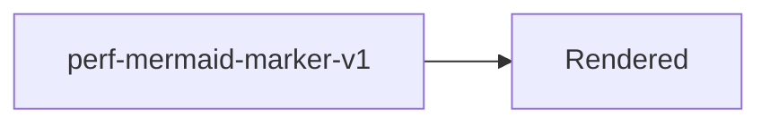

# FeatherMD Rich Performance Fixture

perf-rich-marker-v1

This deterministic document activates the syntax highlighter, KaTeX, and Mermaid without using
remote resources or user-owned files.

## JavaScript

```javascript
const marker = "perf-shiki-javascript-marker-v1";
console.log(marker);
```

## Rust

```rust
fn main() {
    println!("perf-shiki-rust-marker-v1");
}
```

## Mathematics

$$
\text{perf-katex-marker-v1} \qquad \sum_{i=1}^{n} i = \frac{n(n+1)}{2}
$$

## Diagram


