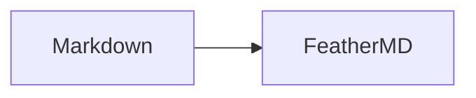

# Markdown compatibility test

This file checks CommonMark, GitHub Flavored Markdown (GFM), and selected
FeatherMD extensions. Each section should remain visually distinguishable.

## 1. Block structure

# ATX level 1
## ATX level 2
### ATX level 3
#### ATX level 4
##### ATX level 5
###### ATX level 6

Setext level 1
==============

Setext level 2
--------------

Paragraph line one
continues on the same rendered line.

Paragraph before a thematic break.

---

Paragraph after a thematic break.

> Block quote level 1
>
> Second paragraph in the quote.
>
> > Nested block quote
>
> - List inside a quote
> - Second quoted item

    Indented code block
    keeps whitespace and *does not emphasize*.

```text
Fenced code block
keeps <tags> and *markers* literal.
```

~~~javascript
const greeting = "tilde fence";
console.log(greeting);
~~~

<details>
<summary>Raw HTML details element</summary>

HTML blocks are enabled, then sanitized before display.

</details>

## 2. Lists

### Unordered marker variants

- Hyphen item
- Second hyphen item

* Asterisk item
* Second asterisk item

+ Plus item
+ Second plus item

### Ordered lists

1. First item
2. Second item
3. Third item

4. Source starts at four
5. Source continues at five

### Nested and mixed lists

- Parent A
  - Child A.1
    1. Grandchild A.1.1
    2. Grandchild A.1.2
  - Child A.2
    - Grandchild A.2.1
      - Great-grandchild A.2.1.1
- Parent B
  1. Ordered child B.1
     - Unordered grandchild
  2. Ordered child B.2

### Loose list

- First item, paragraph one.

  First item, paragraph two. This should have vertical separation.

- Second loose item.

### Continuation blocks in a list

1. Item with a quote

   > Quoted text inside the ordered item.

2. Item with code

   ```json
   { "inside": "list" }
   ```

3. Final item

### Task list (GFM extension)

- [x] Completed task
- [ ] Incomplete task
  - [x] Nested completed task
  - [ ] Nested incomplete task

## 3. Inline markup

Emphasis: *asterisk* and _underscore_.

Strong: **asterisks** and __underscores__.

Combined: ***strong emphasis***, **strong with _nested emphasis_**, and
_emphasis with **nested strong**_.

Delimiter edge cases: foo_bar_baz, a***b***c, **unclosed, and escaped \*literal\*.

Inline code: `const value = "*literal*";` and ``code containing a ` backtick``.

Hard break with two trailing spaces:  
This must start on a new line.

Hard break with backslash:\
This must also start on a new line.

Entity references: &copy; &#169; &#x1F642; &amp;.

Escapes: \# not a heading, \[not a link\], and \`not code\`.

## 4. Links and images

Inline link: [CommonMark](https://commonmark.org "CommonMark specification").

Reference link: [GitHub][github] and [collapsed reference][].

[github]: https://github.com "GitHub"
[collapsed reference]: https://example.com/reference

Autolink: <https://example.com/path?q=markdown> and <user@example.com>.

Linkify extension: https://example.com/bare-url and user@example.com.

Image with data URI (no network access required):


## 5. GFM extensions

### Strikethrough

~~Deleted text~~ and text with ~~a removed phrase~~ inside it.

### Table

| Left aligned | Center aligned | Right aligned | Inline markup |
| :----------- | :------------: | ------------: | ------------- |
| alpha        |      beta      |            10 | **strong**    |
| pipe \| char |     gamma      |             2 | `code`        |

### Extended autolinks

www.example.com, https://example.com, and contact@example.com should be links
when linkify behavior is enabled.

## 6. Common edge cases

The next line is not a list because the marker is not followed by a space:

-not-a-list

The next line is not a heading because the marker is not followed by a space:

#not-a-heading

Ordered list interruption should be handled consistently:

Paragraph before list.
2. A list cannot interrupt a paragraph when it starts at two in CommonMark.

Adjacent list marker changes:

- Unordered item
1. Ordered item
- Unordered again

## 7. FeatherMD extensions and additional dialects

Emoji shortcode: :trophy: :smile: :+1:.

Wiki link extension: [[missing-note|Wiki link label]].

Inline math: $E = mc^2$.



Footnote reference (not part of CommonMark or core GFM): sentence with a note.[^1]
The same footnote can be referenced again.[^1]

An inline footnote is also supported.^[Inline footnote text.]

[^1]: Footnote content with **inline markup** and a back-reference.

### GitHub Alerts

> [!NOTE]
> Useful information that users should know.

> [!TIP]
> Helpful advice for doing things better.

> [!IMPORTANT]
> Key information users need to know.

> [!WARNING]
> Urgent information requiring immediate attention.

> [!CAUTION]
> Advises about risks or negative outcomes.

### Definition list

Term
: First definition with **inline markup**.
: A second definition for the same term.

Another term
: Definition containing `inline code`.

## 8. Sanitization probes

Safe inline HTML: <kbd>Ctrl</kbd> + <kbd>O</kbd>, H<sub>2</sub>O, and
x<sup>2</sup>.

The script below must never execute or remain in the rendered DOM:

<script>document.body.dataset.markdownCompatibilityXss = "executed";</script>

The unsafe link must lose its dangerous target: [unsafe](javascript:alert('xss')).
